# Ontology Tree — Bootstrap + Runtime Init Seeds

**Status:** current as of 2026-06-11 (post F4 B4 Task 1 — `reciprocal_nref` literal added).

This diagram is the **organisational shape of the environment ontology**
immediately after `application:start(database)` finishes. It captures:

- The bootstrap tree from `apps/graphdb/priv/bootstrap.terms` (nrefs 1–35
  plus the seeded English instance at nref 10000).
- Runtime sub-group nodes seeded by `graphdb_attr:init/1`,
  `graphdb_language:init/1`, and `graphdb_rules:init/1` (the L7
  Attribute Literals, Language Literals, and Rule Literals sub-groups,
  plus their child literal-attribute nodes).
- The F4 Phase A rule meta-ontology seeded by `graphdb_rules:init/1`:
  the `Rule` (abstract) / `CompositionRule` / `ConnectionRule`
  meta-classes under Classes (nref 3), and the `applies_to` /
  `applied_by` relationship-attribute pair under Instance
  Relationships (nref 16).

It does **not** show:

- Instance-to-class membership arcs (kind=instantiation, char=29/30) —
  those live in the project DB, not the environment.
- Connection arcs (kind=connection) — same reason.
- Class→Template composition arcs auto-created by
  `graphdb_class:create_class/2`. The `CompositionRule` and
  `ConnectionRule` meta-classes (both instantiable) each carry an
  auto-created default Template; these template nodes and arcs are not
  drawn here.

## How to view

- **GitHub** — renders the Mermaid block inline once pushed.
- **VS Code** — open this file and press `Ctrl+K V` for the markdown
  preview (the built-in renderer supports Mermaid as of VS Code 1.88).
- **mermaid.live** — copy the contents of the ```mermaid block into
  <https://mermaid.live> for a standalone view with zoom/pan.

## Tree

```mermaid
graph LR
  classDef cat   fill:#ffe0b3,stroke:#cc8400,color:#000
  classDef attr  fill:#cfe2ff,stroke:#0066cc,color:#000
  classDef inst  fill:#d4edda,stroke:#28a745,color:#000
  classDef group fill:#e2d4f5,stroke:#6f42c1,color:#000
  classDef cls fill:#ffd6e7,stroke:#c2185b,color:#000

  %% --- Root ---
  N1["Root<br/>(1, category)"]:::cat
  N2["Attributes<br/>(2, category)"]:::cat
  N3["Classes<br/>(3, category)"]:::cat
  N4["Languages<br/>(4, category)"]:::cat
  N5["Projects<br/>(5, category)"]:::cat

  %% --- Attributes top-level groups ---
  N6["Names<br/>(6, attribute)"]:::attr
  N7["Literals<br/>(7, attribute)"]:::attr
  N8["Relationships<br/>(8, attribute)"]:::attr

  %% --- Names sub-tree ---
  N9["Category Name Attrs<br/>(9, attribute)"]:::attr
  N10["Attribute Name Attrs<br/>(10, attribute)"]:::attr
  N11["Class Name Attrs<br/>(11, attribute)"]:::attr
  N12["Instance Name Attrs<br/>(12, attribute)"]:::attr

  N17["name (category)<br/>(17, attribute)"]:::attr
  N18["name (attribute, self-ref)<br/>(18, attribute)"]:::attr
  N19["name (class)<br/>(19, attribute)"]:::attr
  N20["name (instance)<br/>(20, attribute)"]:::attr

  %% --- Literals sub-tree (L7 sub-groups) ---
  NAL["Attribute Literals<br/>(runtime, sub-group)"]:::group
  NLL["Language Literals<br/>(runtime, sub-group)"]:::group
  NRL["Rule Literals<br/>(runtime, sub-group)"]:::group

  NLT["literal_type<br/>(runtime, attribute)"]:::attr
  NTK["target_kind<br/>(runtime, attribute)"]:::attr
  NRA["relationship_avp<br/>(runtime, attribute)"]:::attr
  NAT["attribute_type<br/>(runtime, attribute)"]:::attr
  NIN["instantiable<br/>(runtime, attribute)"]:::attr
  NBL["base_language<br/>(runtime, attribute)"]:::attr
  NPL["project_language<br/>(runtime, attribute)"]:::attr
  NRCC["child_class_nref<br/>(runtime, attribute)"]:::attr
  NRTC["target_class_nref<br/>(runtime, attribute)"]:::attr
  NRTN["template_nref<br/>(runtime, attribute)"]:::attr
  NRCH["characterization_nref<br/>(runtime, attribute)"]:::attr
  NRRE["reciprocal_nref<br/>(runtime, attribute)"]:::attr
  NRMO["mode<br/>(runtime, attribute)"]:::attr
  NRMU["multiplicity<br/>(runtime, attribute)"]:::attr
  NRNP["name_pattern<br/>(runtime, attribute)"]:::attr

  %% --- Relationships sub-tree ---
  N13["Category Relationships<br/>(13, attribute)"]:::attr
  N14["Attribute Relationships<br/>(14, attribute)"]:::attr
  N15["Class Relationships<br/>(15, attribute)"]:::attr
  N16["Instance Relationships<br/>(16, attribute)"]:::attr

  N21["Parent (cat arc)<br/>(21, attribute)"]:::attr
  N22["Child (cat arc)<br/>(22, attribute)"]:::attr
  N23["Parent (attr arc, self-ref)<br/>(23, attribute)"]:::attr
  N24["Child (attr arc, self-ref)<br/>(24, attribute)"]:::attr
  N25["Parent (class arc)<br/>(25, attribute)"]:::attr
  N26["Child (class arc)<br/>(26, attribute)"]:::attr
  N27["Parent (inst arc)<br/>(27, attribute)"]:::attr
  N28["Child (inst arc)<br/>(28, attribute)"]:::attr
  N29["Class (inst&rarr;class)<br/>(29, attribute)"]:::attr
  N30["Instance (class&rarr;inst)<br/>(30, attribute)"]:::attr
  N31["Template (avp marker)<br/>(31, attribute)"]:::attr
  NRAT["applies_to (rule arc)<br/>(runtime, attribute)"]:::attr
  NRAB["applied_by (rule arc)<br/>(runtime, attribute)"]:::attr

  %% --- Classes sub-tree (F4 Phase A rule meta-ontology) ---
  NRULE["Rule (abstract)<br/>(runtime, class)"]:::cls
  NCMPR["CompositionRule<br/>(runtime, class)"]:::cls
  NCONR["ConnectionRule<br/>(runtime, class)"]:::cls

  %% --- Languages sub-tree ---
  N32["Human Languages<br/>(32, category)"]:::cat
  N33["Formal Languages<br/>(33, category)"]:::cat
  N34["Diagram Languages<br/>(34, category)"]:::cat
  N35["Renderers<br/>(35, category)"]:::cat
  N10000["English<br/>(10000, instance)"]:::inst

  %% =============================================================
  %% Edge style legend:
  %%   -->   solid arrow = composition (organisational / part-of)
  %%   ==>   thick arrow = taxonomy    (refinement / is-a-kind-of)
  %%   -.->  dotted arrow = instantiation (reserved; not in tree)
  %% =============================================================

  %% --- Composition: category scaffold (chars 21/22) ---
  N1 --> N2
  N1 --> N3
  N1 --> N4
  N1 --> N5

  %% --- Composition: language subcategories (chars 21/22) ---
  N4 --> N32
  N4 --> N33
  N4 --> N34
  N4 --> N35

  %% --- Composition: instance parts (chars 27/28) ---
  N32 --> N10000

  %% --- Taxonomy: Attributes top-level (chars 23/24) ---
  N2 ==> N6
  N2 ==> N7
  N2 ==> N8

  %% --- Taxonomy: Names sub-tree ---
  N6 ==> N9
  N6 ==> N10
  N6 ==> N11
  N6 ==> N12
  N9 ==> N17
  N10 ==> N18
  N11 ==> N19
  N12 ==> N20

  %% --- Taxonomy: Literals + L7 sub-groups ---
  N7 ==> NAL
  N7 ==> NLL
  N7 ==> NRL
  NAL ==> NLT
  NAL ==> NTK
  NAL ==> NRA
  NAL ==> NAT
  NAL ==> NIN
  NLL ==> NBL
  NLL ==> NPL
  NRL ==> NRCC
  NRL ==> NRTC
  NRL ==> NRTN
  NRL ==> NRCH
  NRL ==> NRRE
  NRL ==> NRMO
  NRL ==> NRMU
  NRL ==> NRNP

  %% --- Taxonomy: Relationships sub-tree ---
  N8 ==> N13
  N8 ==> N14
  N8 ==> N15
  N8 ==> N16
  N13 ==> N21
  N13 ==> N22
  N14 ==> N23
  N14 ==> N24
  N15 ==> N25
  N15 ==> N26
  N16 ==> N27
  N16 ==> N28
  N16 ==> N29
  N16 ==> N30
  N16 ==> N31
  N16 ==> NRAT
  N16 ==> NRAB

  %% --- Taxonomy: Classes — F4 Phase A rule meta-ontology ---
  N3 ==> NRULE
  NRULE ==> NCMPR
  NRULE ==> NCONR
```



## Legend

| Colour | Kind                                      |
| ------ | ----------------------------------------- |
| Orange | Category node                             |
| Blue   | Attribute node                            |
| Purple | Attribute sub-group node (runtime-seeded) |
| Green  | Instance node                             |
| Pink   | Class node (runtime-seeded)               |

Edges are parent → child arcs, styled by **arc kind** (not by colour):

| Line style    | Arc kind        | Meaning                         |
| ------------- | --------------- | ------------------------------- |
| `-->` solid   | `composition`   | organisational / part-of        |
| `==>` thick   | `taxonomy`      | refinement / is-a-kind-of       |
| `-.->` dotted | `instantiation` | (reserved; not in this subtree) |

Subtree → arc kind:

| Subtree                       | Arc kind      | Char nrefs (Parent / Child)   |
| ----------------------------- | ------------- | ----------------------------- |
| Category scaffold (1, 2-5)    | `composition` | 21 / 22                       |
| Attribute taxonomy (6-31)     | `taxonomy`    | 23 / 24                       |
| Languages (4 → 32-35 → 10000) | `composition` | 21 / 22 (cat), 27 / 28 (inst) |

## Quick-reference

| Nref  | Kind      | Role                                                                                         |
| ----- | --------- | -------------------------------------------------------------------------------------------- |
| 1     | category  | Root                                                                                         |
| 2-5   | category  | Top-level scaffold (Attributes, Classes, Languages, Projects)                                |
| 6-8   | attribute | Attribute-library groupings (Names, Literals, Relationships)                                 |
| 9-12  | attribute | Name-attribute sub-groups (one per Kind)                                                     |
| 13-16 | attribute | Relationship sub-groups (one per Kind)                                                       |
| 17-20 | attribute | Concrete name attributes (one per Kind)                                                      |
| 21-31 | attribute | Concrete arc-label nodes (Parent/Child per Kind, plus Class/Instance/Template for instances) |
| 32-35 | category  | Language subcategories (Human, Formal, Diagram, Renderers)                                   |
| 10000 | instance  | English (member of Human Languages)                                                          |

Runtime sub-group / attribute / class nrefs sit at 10000+ and are not
enumerated here (they shift between sessions); the L7 Attribute
Literals and Language Literals sub-groups are seeded by
`graphdb_attr:init/1` and `graphdb_language:init/1`, and the F4
Rule Literals sub-group (8 literals, including `reciprocal_nref` added
in B4) plus the `Rule` / `CompositionRule` / `ConnectionRule`
meta-classes and the `applies_to` / `applied_by` pair are seeded by
`graphdb_rules:init/1`.

## Maintenance

This file is hand-maintained. Update it in the same commit whenever:

- `apps/graphdb/priv/bootstrap.terms` adds/removes/reparents a node.
- Any `init/1` in `graphdb_attr`, `graphdb_class`, `graphdb_instance`,
  `graphdb_language`, or `graphdb_rules` adds/removes/reparents a
  runtime-seeded node.
- A new `graphdb_*` worker is added that seeds at startup.

If hand-maintenance becomes lossy as runtime seeds grow (F4, F5+), swap
to a `rebar3 ontology-tree` escript that reads bootstrap.terms and
introspects the seed lists. Not needed yet.
